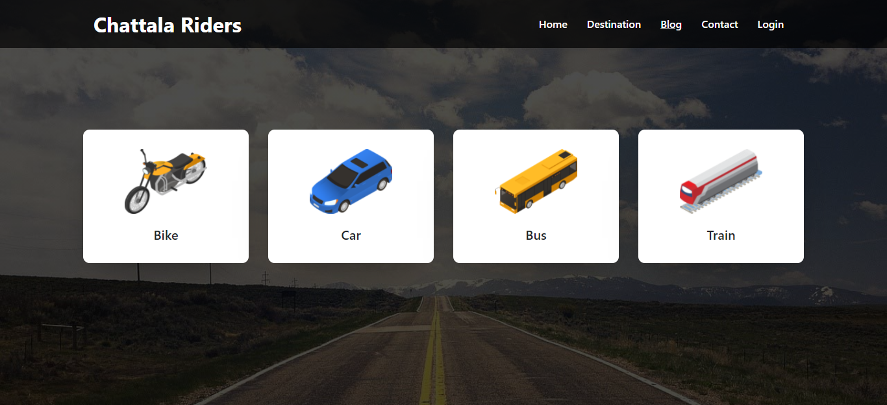

# Chattala Riders

## Description

Features
===============
1. It is simple riders react project with firebase authentication.
2. In this project user choose the rider option from the home page.
3. User have to login or register first choose any ride.
4. User can login using Google and facebook.
5. After login show the logged in user name in header section. User can set the place and date for query. Then show the related result.

Front-end Technology: React Js, React Router, React Bootstrap 
Back-end Technology: Node Js, Express JS, MongoDB

## Project Live Link
[Chattala Riders](https://urban-rider-c4f6f.web.app/)
